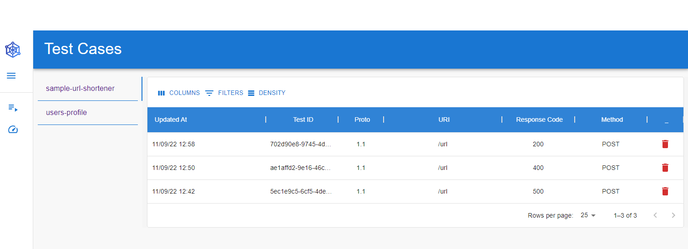
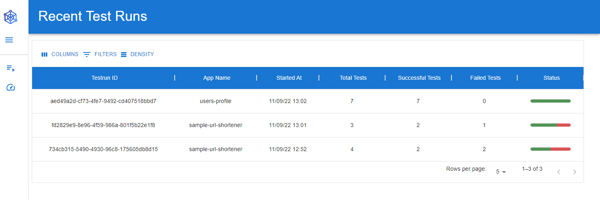
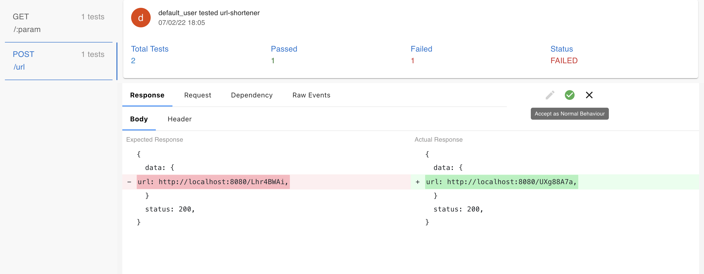

Keploy Console consists of 2 pages majorly :

1. [Test Cases](/docs/operation/web-ui-operations/#test-cases)
2. [Test Runs](/docs/operation/web-ui-operations/#test-runs)

## Test Cases

The Test Cases page lists all the Application names and their respective Test-Cases captured.

You can see the details of the Test Cases captures. Currently following details can be seen from the Web console :

- API Request
- API Response
- Dependency Captured Type and Operation
- Raw Event with details like noisy and anchor fields

### Edit a Test Case

To change the behavior of the API request captured as a test-case, you can go to the detail of the test-case and click on Edit icon.

> Please note that editing a test-case is not a recommended practice since the dependency behavior might change with the change
> of the API request. It's suggested to re-record the test-case and delete the previous one if not applicable.

### Delete a Test Case

You can delete the test-case from the test-cases listing page by clicking on the Delete Icon.

## Test Runs

On the Test runs pages you will see the recent Test Runs with details like :

1. Number of Test Cases for the given application
2. Number of Test Cases Successfully Ran
3. Number of Test Cases Failed
4. Meta details like : App name, time, user.

### Normalise a Test Case

For times, when the behavior of the API changes and Keploy flags it while testing the application, you can
go to the test run and particular test case detail that failed and mark it as normalised behaviour.

This will modify the test-case and will be accepted as the expected response for future test runs.

> Note : Since Test Runs are historical, normalising a test-case result in a test-run would not mark it success.
