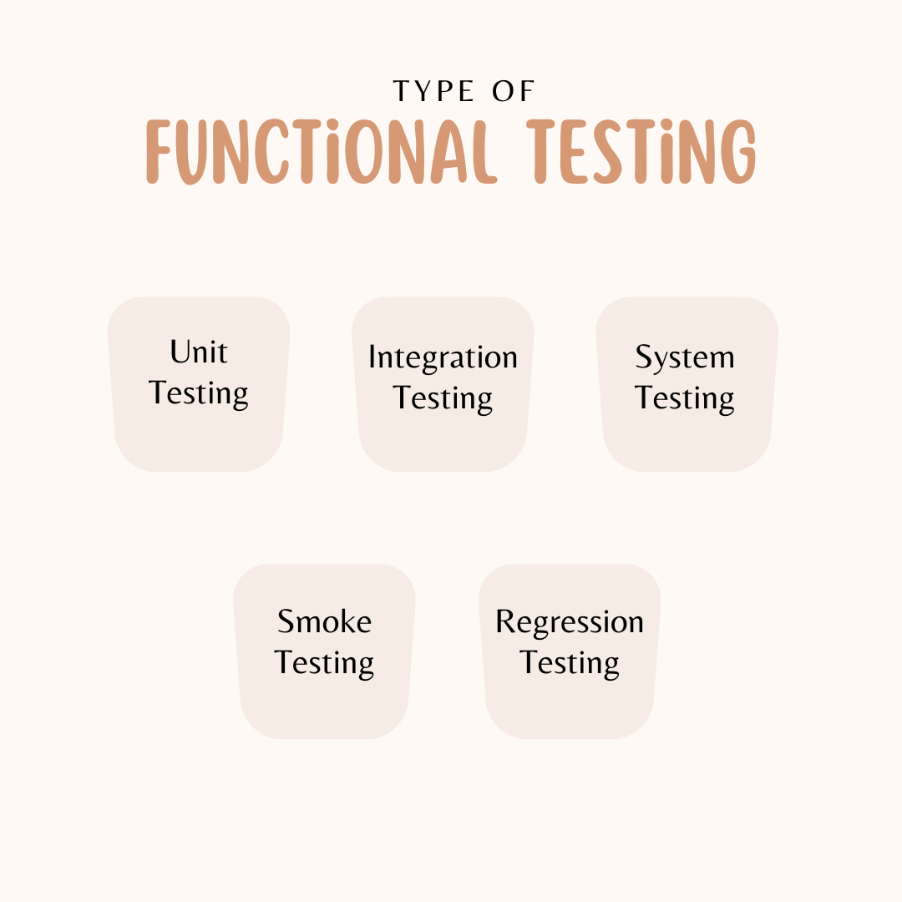

Functional testing is a type of software testing that verifies that the software system or application behaves according to the specified functional requirements and meets the intended business needs. It focuses on ensuring that the system's features, capabilities, and interactions with different components work as expected.

Functional testing is typically performed by providing the software with input data and then checking the output data to see if it matches the expected results. This can be done manually or using automated testing tools.

## Types of Funtional Testing

There are many different types of functional testing : 

### 1. **Unit Testing**

Unit testing is the most granular form of functional testing, focusing on individual components or modules of the software. Developers typically write unit tests to ensure that each function or method performs as expected. The goal is to verify that a single unit of the software works independently before integrating it with other units.

**Example:** Consider a function that calculates the sum of two numbers. Unit testing would involve writing test cases to check if the function:
- Returns the correct sum for positive integers.
- Handles negative numbers correctly.
- Deals with edge cases, such as zero or extremely large values.

Each of these scenarios would be tested in isolation to confirm that the function behaves as expected.

### 2. **Integration Testing**

Integration testing ensures that different modules or components of the software work together correctly. While unit tests verify individual parts, integration testing focuses on how they interact when combined. This technique is essential for uncovering issues that arise due to the interaction between modules.

**Example:** In an e-commerce platform, individual modules like the product catalog, shopping cart, and payment system may pass their respective unit tests. However, integration testing ensures that:
- The shopping cart properly calculates the total price based on items from the catalog.
- The payment system successfully processes transactions using the data passed from the cart.

By simulating real-world interactions between modules, integration testing ensures smooth communication across components.

### 3. **System Testing**

System testing is a comprehensive technique that evaluates the complete and integrated system. It tests the software as a whole to ensure it meets the functional requirements. The goal is to validate that all features work together as expected in the final product.

**Example:** For a social media application, system testing might include scenarios like:
- Creating, editing, and deleting a post.
- Liking and sharing posts.
- Sending friend requests and messages.

System testing covers the entire workflow to ensure that the software behaves as a fully functional system.

### 4. **Smoke Testing**

Smoke testing, also known as "sanity testing," is a quick and basic check to determine if the core functionalities of the software are working. It’s typically performed after a new build to ensure that no critical issues exist before proceeding to more in-depth testing. If the smoke test passes, the software is considered stable enough for further testing.

**Example:** For a mobile app, a smoke test might include:
- Launching the app and verifying that it loads properly.
- Logging into the app with valid credentials.
- Navigating to a few critical screens to ensure no crashes occur.

By quickly validating key functions, smoke testing saves time by catching major issues early.

### 5. **Regression Testing**

Regression testing involves re-testing the entire software or selected parts to ensure that recent code changes haven't broken any existing functionality. It is crucial after bug fixes, enhancements, or updates to make sure that previously working features still perform correctly.

**Example:** After fixing a bug in the user registration process, regression testing would re-test not only the registration feature but also other related features like login, profile updates, and password recovery, ensuring that nothing else was impacted by the change.

By maintaining stable software over time, regression testing prevents unwanted side effects from updates.

## What Do You Test in Functional Testing?

### 1. User Interface (UI)
The user interface is often the first point of interaction for users, making it essential for functional testing. Here, we check if:
- All buttons, forms, and elements are present and functional.
- The interface behaves as expected across different devices and browsers.
- User inputs (like text fields, drop-down menus, etc.) are validated and handled correctly.

### 2. APIs
APIs serve as the backbone of communication between different services in a system. During functional testing, API tests focus on:
- Validating API responses for different requests.
- Ensuring API endpoints perform the expected operations (GET, POST, PUT, DELETE).
- Handling errors and edge cases effectively.

### 3. Forms and Data Entry
Forms are common in web and mobile applications, and testing them involves:
- Verifying input field behaviors for different data types (e.g., text, numbers, special characters).
- Ensuring proper data validation, error messages, and form submission processes.
- Testing field limits and edge cases, like empty fields or invalid inputs.

### 4. Business Logic
This is where the core functionality of the application is tested. We ensure that:
- The software performs the tasks it’s supposed to, based on business requirements.
- Calculations, workflows, and rule engines execute properly.
- Conditions, loops, and processes operate as intended, without deviation from the expected results.

### 5. Database Operations
Functional testing extends to database verification to confirm:
- Correct data is stored, retrieved, updated, and deleted.
- The integrity and consistency of data is maintained across different functions.
- Transactions and error handling work as expected.

## Benefits of functional testing:

- It helps to ensure that the software system meets the specified requirements.
- It helps to identify defects in the software system early in the development process.
- It helps to improve the quality of the software system.
- It helps to reduce the risk of system failure.

## Challenges of functional testing:

- It can be time-consuming and expensive.
- It can be difficult to test all of the possible scenarios.
- It can be difficult to test the software system in its real-world environment.

Despite the challenges, functional testing is an important part of the software testing process. By following good functional testing practices, you can help to ensure that the software system meets the specified requirements and meets the intended business needs.
