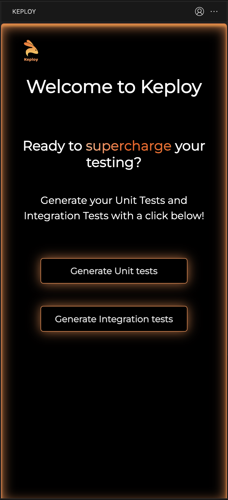
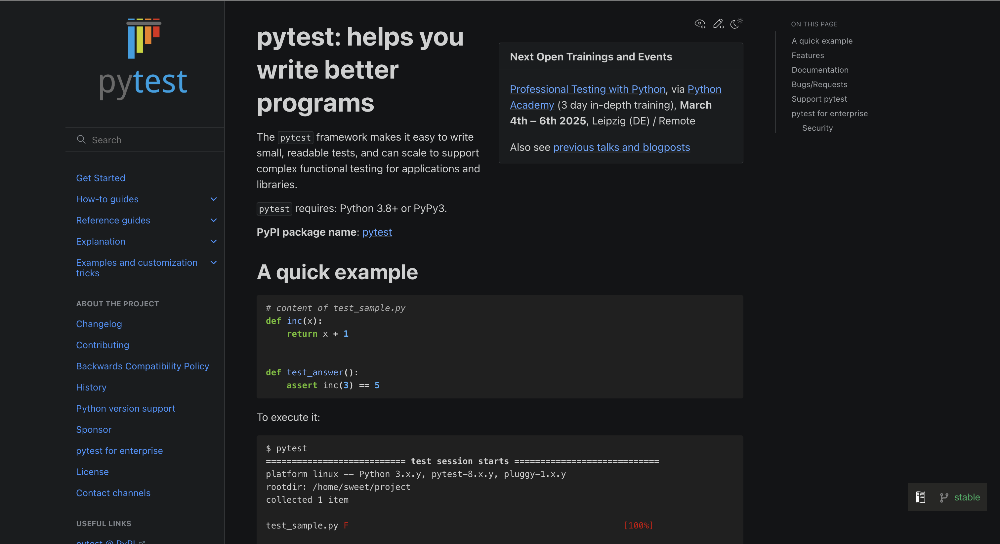
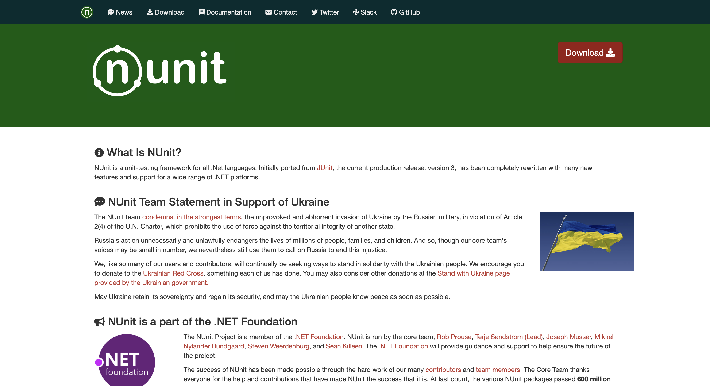
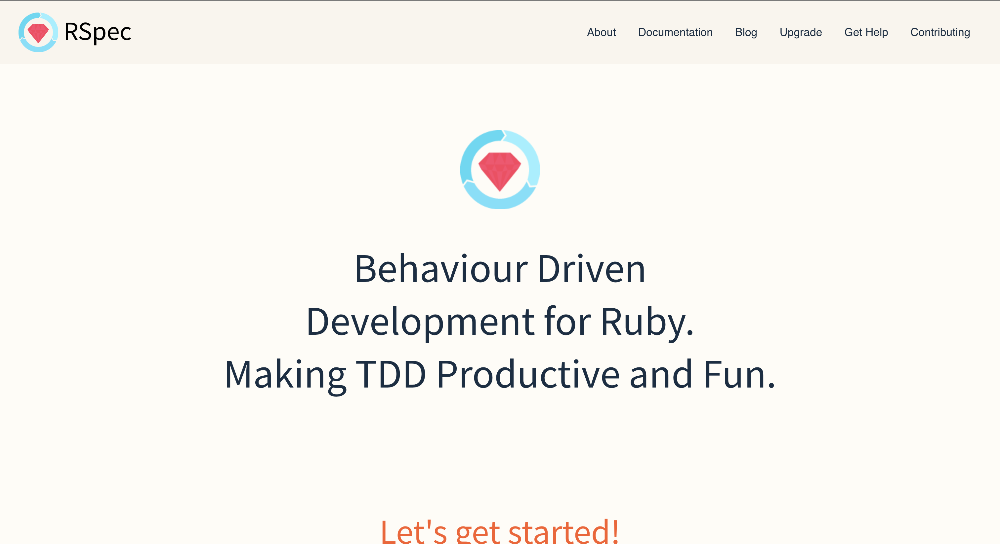
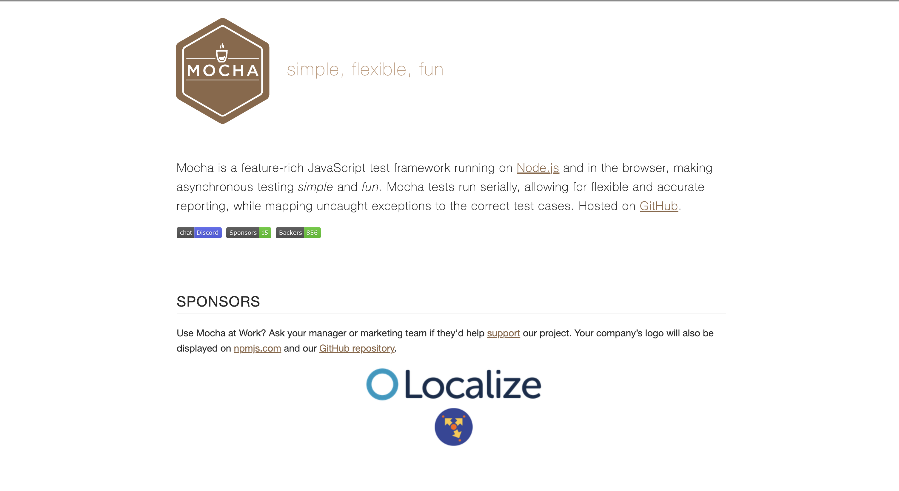
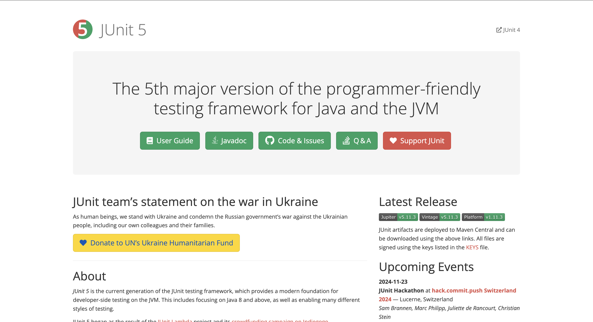
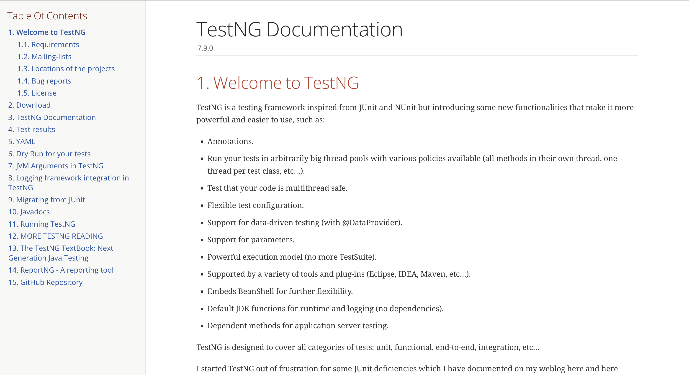

Automating Unit Test is the practice of using automated tools and scripts to execute a set of predefined tests on individual units of code. These tests verify that each unit functions as intended, isolating and validating specific functionalities in an automated and repeatable manner.

Unit Test Automation enhances software development efficiency by quickly identifying errors, ensuring code reliability, and facilitating continuous integration and delivery processes.

## How Does Unit Test Automation Work?

Unit test automation focuses on verifying individual pieces of code (functions or methods) in isolation, ensuring they work as expected. Here’s how it generally works:

1. **Writing Test Cases**: Developers create tests for specific code units, verifying outputs for given inputs. Test cases often include various scenarios to validate robustness.

2. **Using Mocks and Stubs**: To isolate the unit, mocks or stubs simulate other parts of the system, allowing testing without dependencies.

3. **Automated Execution**: Tests run automatically whenever code is committed to version control, ensuring new changes don’t break existing functionality.

4. **Continuous Feedback**: Automated tests provide immediate feedback, enabling rapid issue identification and fixing, which helps maintain high code quality.

## What are the benefits of unit test automation?

There are many benefits to unit test automation, including:

## What are the Benefits of Unit Test Automation?

Unit test automation offers many advantages, including:

- **Early Bug Detection**:  
  Unit tests help developers catch bugs early by isolating and testing small parts of the code independently.  
  **Example**: Imagine a function `calculateDiscount(price, discount)` that applies a discount to a price. If an error occurs, such as incorrectly applying the discount formula, a unit test can catch this before it's integrated, preventing larger issues down the line.

- **Code Refactoring**:  
  Unit tests act as a safety net during refactoring. With automated tests in place, developers can confidently make changes, knowing they won’t break existing functionality.  
  **Example**: If you’re refactoring a `processOrder()` function to improve performance, unit tests validate the refactored function against expected outcomes, ensuring core functionality hasn’t changed.

- **Improved Code Quality**:  
  Writing unit tests encourages modular, well-structured code since units that are easier to test are typically organized and maintainable.  
  **Example**: If a complex `calculateShipping()` function has dependencies, it might be refactored into smaller functions (e.g., `calculateWeight()`, `determineShippingRate()`). This makes each part easier to test and maintain, improving the overall quality of the code.

- **Documentation and Examples**:  
  Unit tests serve as examples of intended usage, providing insight into how specific components should function. They also serve as documentation that stays up-to-date as the code evolves.  
  **Example**: For a new developer onboarding to a project, unit tests for functions like `processPayment()` demonstrate expected behavior, helping them understand how to use and integrate the function.

- **Regression Testing**:  
  Unit tests act as a form of [regression testing](https://keploy.io/docs/concepts/reference/glossary/regression-testing), quickly alerting developers to unintended changes after updates or modifications.  
  **Example**: If a developer modifies the `applyCoupon()` function, running the associated unit tests will immediately indicate if the changes inadvertently affected other functionalities, maintaining consistency across updates.

In addition to the benefits listed above, unit test automation can also help to:

- Improve the maintainability of code by making it easier to track changes and identify potential problems.
- Improve the documentation of code by providing test cases that demonstrate how the code is supposed to work.
- Support continuous integration and continuous delivery (CI/CD) pipelines. This allows teams to release new code more frequently and with greater confidence.

Unit test automation is a valuable tool for software development teams that care about quality, reliability, and efficiency. When done well, it can greatly improve the development process and the time it takes to release a product.

## Best Practices for Effective Unit Test Automation

### 1. Write Clear and Concise Tests

Ensure that your unit tests are easy to read and understand. This makes it easier for other developers to maintain and update them in the future.

### 2. Follow the Arrange-Act-Assert Pattern

Structure your tests using the Arrange-Act-Assert pattern to enhance readability. Arrange the necessary inputs, act by invoking the method under test, and assert the expected outcomes.

### 3. Keep Tests Independent

Ensure that each unit test can run independently of others. This prevents side effects and makes it easier to identify which tests fail when an error occurs.

### 4. Use Meaningful Test Names

Name your tests descriptively to indicate what functionality is being tested. This makes it easier to understand the purpose of each test at a glance.

### 5. Automate Your Test Suite

Integrate your unit tests into your CI/CD pipeline to ensure they run automatically with every code change. This keeps your codebase stable and reduces the risk of introducing bugs.

## Common Pitfalls to Avoid

- **Overly Complex Tests**: Avoid writing tests that are too complex or that test multiple functionalities at once. Each test should ideally cover one specific behavior.

- **Neglecting Edge Cases**: Ensure your tests cover edge cases and not just typical scenarios. This helps identify issues that might arise under unusual conditions.

- **Ignoring Test Failures**: Treat failing tests as a critical issue rather than a minor inconvenience. Investigate and fix them promptly to maintain the integrity of your code.

## What are some unit test automation tools?

There are many unit testing tools available for a wide range of languages and environments. Some popular tools include:

### Keploy

Keploy offers a one-click unit test generation tool that streamlines the testing process for developers. Instead of spending time writing test cases from scratch, you can generate them instantly, allowing you to focus on coding and delivering new features.

**Benefits of Using Keploy:**

- **Efficiency**: Quickly create unit tests to save time and effort.
- **Enhanced Coverage**: Automatically generate tests for various scenarios, improving code reliability.
- **Focus on Quality**: Spend more time writing high-quality code while ensuring thorough validation.
  

Get started by downloading the tool from the [VS Code Marketplace](https://marketplace.visualstudio.com/items?itemName=Keploy.keployio) and boost your development workflow today!

### pytest (Python)

pytest is a feature-rich and easy-to-use testing framework for Python. It supports the creation of simple unit tests as well as complex functional testing scenarios. pytest’s concise syntax and powerful features make it a preferred choice for Python developers.

### NUnit (.NET):

NUnit is a unit testing framework for .NET applications. It is widely used for testing C# and F# code. NUnit supports parameterized tests, assertions, and various attributes to customize test behavior.

### RSpec (Ruby):

RSpec is a behavior-driven development (BDD) framework for Ruby. It focuses on readability and expressiveness, allowing developers to write tests that resemble natural language. RSpec supports descriptive syntax for writing specifications and expectations.

### Mocha (JavaScript/Node.js):

Mocha is a versatile testing framework for JavaScript and Node.js applications. It supports both asynchronous and synchronous testing and provides a flexible and extensible structure. Mocha is often used in conjunction with assertion libraries like Chai.

### JUnit 5 (Java):

JUnit 5 is the next generation of the JUnit framework, introducing new features and improvements over JUnit 4. It supports parameterized tests, test interfaces, and extensions, providing a more modern and flexible testing experience.

### TestNG (Java):

TestNG is another testing framework for Java, designed to cover a broader range of testing categories, including unit, functional, and integration testing. It supports parallel execution, data-driven testing, and easy configuration through annotations.

## Conclusion

Unit test automation is a fundamental practice in modern software development. By implementing effective unit testing strategies and utilizing the right tools, developers can improve code quality, reduce bugs, and enhance the overall efficiency of their development processes. Whether you're a seasoned developer or new to coding, investing in unit test automation will pay dividends in the long run.

## Frequently Asked Questions (FAQ)

### What is the difference between unit testing and integration testing?

**Unit Testing** focuses on testing individual components or functions in isolation to ensure they work as expected. It verifies the smallest parts of an application.  
**Integration Testing**, on the other hand, tests how different modules or components work together, ensuring they interact correctly when combined.

### When should I write unit tests?

Unit tests should be written during the development process, ideally before or alongside the implementation of new features. This practice, known as Test-Driven Development (TDD), encourages writing tests before the code itself, leading to better design and fewer bugs.

### How much time should I invest in writing unit tests?

While the initial investment in writing unit tests may seem high, it often pays off in the long run. A general guideline is to allocate around 15-30% of your development time to writing tests. This ensures comprehensive coverage without significantly slowing down the development process.

### Can unit tests replace manual testing?

Unit tests cannot fully replace manual testing. They are designed to catch bugs at a code level but do not validate user experience or interface functionality. Manual testing remains essential for exploratory tests, user acceptance testing, and scenarios that require human judgment.
