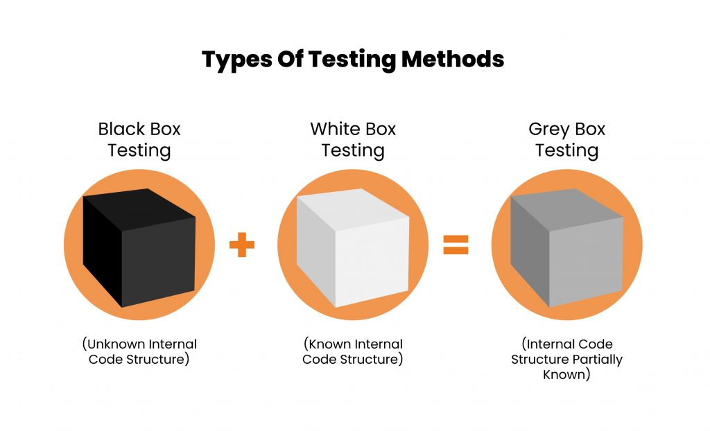

## What is White Box Testing?

White box testing, also known as clear box or glass box testing, is a software testing technique that examines the internal structures of a program. It involves looking at the code, internal logic, and data flow to ensure the software behaves as expected. By understanding how the system works inside, testers can create and run more effective test scenarios.

## Why is White Box Testing Important?

The primary goal of white box testing is to validate the software's internal operations, ensuring that it functions correctly and efficiently. This involves checking all pathways and conditions, optimizing code for speed and performance, and ensuring that there are no hidden errors.

## Fundamentals of White Box Testing

White box testing is essential for verifying the correctness and efficiency of code. Here’s why it’s crucial:

- **Identify Logical Errors**: It helps in uncovering logical flaws in the code.
- **Ensure Path Coverage**: Every possible path through the code is tested.
- **Verify Calculations**: Ensures that calculations and data manipulations are correct.
- **Assess Code Quality**: Checks the structure and organization of the code for better maintainability.

## Types of White Box Testing Techniques

White box testing involves various techniques to ensure comprehensive coverage:

1. **Statement Coverage**: Ensures every line of code is executed.
2. **Branch Coverage**: Tests all possible paths, including if-else conditions.
3. **Path Coverage**: Ensures all potential paths in the code are tested.
4. **Condition Coverage**: Checks all logical conditions.
5. **Data Flow Coverage**: Tests the path of data through the code.
6. **Loop Testing**: Validates the functionality of loops.
7. **Code Reviews**: Detects flaws, security issues, and performance bottlenecks.

## Tools for White Box Testing

Using the right tools can streamline white box testing:

- **Code Coverage Tools**: Measure how much of the code is covered by tests.
- **Debuggers**: Help in identifying and fixing bugs.
- **Static Code Analysis Tools**: Analyze code for potential issues without executing it.
- **Profiling Tools**: Identify performance issues by monitoring resource usage.
- **Unit Testing Frameworks**: Automate testing of individual units of code.

## Overcoming Challenges in White Box Testing

### 1. Expertise Required:

White box testing requires in-depth knowledge of programming languages, algorithms, and data structures, making it a task for skilled professionals.

### 2. Comprehensive Coverage:

Ensuring every code path is tested, especially in large systems, demands meticulous planning.

### 3. Maintenance Overhead:

As code evolves, test cases must be updated, requiring ongoing coordination with development teams.

As code evolves, test cases must be updated, requiring ongoing coordination with development teams.

## Best Practices for Effective White Box Testing

1. **Collaboration with Developers**:
   White box testing is most effective when testers collaborate closely with developers. This ensures a shared understanding of the codebase, facilitates knowledge transfer, and streamlines the identification and resolution of issues.

2. **Automated Testing Tools**:
   Leveraging automated testing tools can significantly enhance the efficiency and coverage of white box testing. These tools assist in executing test cases, tracking code coverage, and generating reports, reducing the manual effort required.

3. **Test-Driven Development (TDD)**:
   Test-Driven Development encourages writing test cases before implementing the actual code. This approach ensures that the code meets the specified requirements and promotes a culture of continuous testing throughout the development process.

### White Box Testing vs. Black Box Testing

| **Aspect**             | **White Box Testing**                           | **Black Box Testing**                                 |
| ---------------------- | ----------------------------------------------- | ----------------------------------------------------- |
| Knowledge Required     | Internal structure and implementation details   | No knowledge of internal structure                    |
| Focus                  | Internal logic and code behavior                | External behavior and functionality                   |
| Skill Level            | Requires specialized technical skills           | Can be performed by testers with various skill levels |
| Types of Defects Found | Internal logic errors, security vulnerabilities | Functional, usability, and performance issues         |

## How to perform Whitebox testing with Keploy ?

Firstly, install [Keploy](https://keploy.io/), a testing tool that helps you automate the testing process. Here’s how you can perform white box testing with Keploy:

- **Instrument Your Code:** Use Keploy’s instrumentation to capture interactions and internal processes. Keploy works at a kernel and network level, capturing data flows, API calls, and other internal interactions without modifying your application code.

- **Record Test Scenarios:** Run your application and perform different operations. Keploy will record these interactions and generate test cases based on the internal workings of your application.

- **Generate and Customize Test Cases:** Keploy automatically generates test cases from the recorded interactions. You can customize these test cases to focus on specific internal paths, edge cases, or critical code areas that need thorough testing.

- **Execute Tests and Analyze Results:** Run the generated test cases using Keploy. It will execute the tests and provide detailed reports on code coverage, including insights into which parts of your code were exercised and which were not.

- **Error Analysis and Debugging:** Utilize Keploy’s built-in error analysis tools to identify and resolve issues within your code. Keploy provides detailed insights into errors, helping you quickly pinpoint and fix problems in the internal logic of your application.

- C**ontinuous Integration and Testing:** Integrate Keploy with your CI pipeline to automate white box testing. This ensures that internal testing is part of your regular development workflow, helping maintain high code quality and quickly catch regressions or new issues.

## Conclusion

White box testing is invaluable for uncovering hidden errors and optimizing performance. While it requires technical expertise, its thorough approach ensures robust, secure, and high-performing software. Combining white box testing with black box testing offers comprehensive coverage, enhancing the overall quality of your applications.

## FAQs

### What is white box testing?

White box testing examines the internal structures of an application, ensuring that the code behaves as expected and meets requirements.

### What are the primary goals of white box testing?

- Verify code correctness.
- Ensure all paths are executed.
- Check calculations and data manipulations.
- Assess code quality.

### What tools are commonly used in white box testing?

- Code Coverage Tools
- Debuggers
- Static Code Analysis Tools
- Profiling Tools
- Unit Testing Frameworks

### What are the main challenges of white box testing?

- Requires technical expertise.
- Comprehensive coverage is difficult.
- High maintenance overhead.

### How does white box testing differ from black box testing?

| **Aspect**                 | **White Box Testing**                           | **Black Box Testing**                                 |
| -------------------------- | ----------------------------------------------- | ----------------------------------------------------- |
| **Knowledge Required**     | Internal structure and implementation details   | No knowledge of internal structure                    |
| **Focus**                  | Internal logic and code behavior                | External behavior and functionality                   |
| **Skill Level**            | Requires specialized technical skills           | Can be performed by testers with various skill levels |
| **Types of Defects Found** | Internal logic errors, security vulnerabilities | Functional, usability, and performance issues         |

### What are the benefits of white box testing?

- Thorough testing of logic and pathways.
- Identifies security vulnerabilities.
- Optimizes performance and resource usage.
- Ensures all code parts are tested.

### What are the limitations of white box testing?

- Time-consuming and expensive.
- Requires skilled testers.
- May not address external behavior or usability.

### When should white box testing be used?

- When detailed internal knowledge is available.
- To test logic, security, and performance.
- For early bug detection during development.

### How can white box testing be made more effective?

- Collaborate with developers.
- Use automated tools.
- Implement Test-Driven Development (TDD).

### Can white box testing and black box testing be used together?

Yes, combining both methods ensures comprehensive coverage, validating internal logic and external behavior.

### What is Test-Driven Development (TDD) and how does it relate to white box testing?

TDD involves writing tests before code, ensuring requirements are met. It aligns with white box testing by emphasizing internal logic during test creation.
