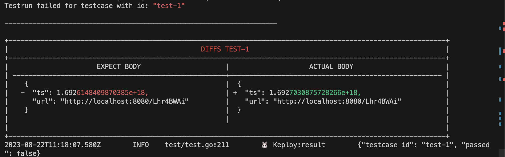
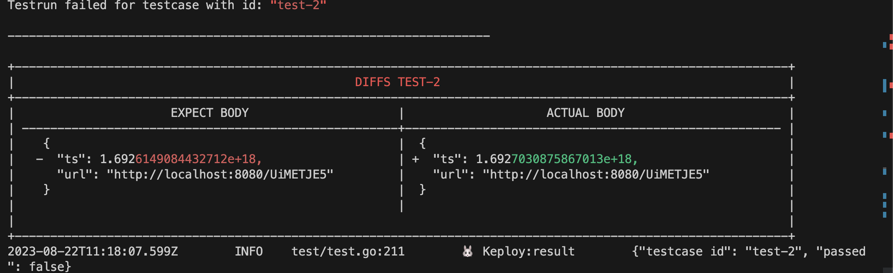

## Introduction

A sample url shortener app to test Keploy integration capabilities using [Gin](https://gin-gonic.com/) and [mongoDB](https://www.mongodb.com/).

## Setup URL shortener

```bash
git clone https://github.com/keploy/samples-go.git && cd samples-go/gin-mongo
go mod download
```

## Installation

There are two methods to run the sample application using Keploy :-

1. [Using Docker](#running-app-using-docker)
2. [Natively on Ubuntu/Windows(using WSL)](#run-app-natively-on-local-machine)

## Running app using Docker

Keploy can be used on Linux & Windows through [Docker](https://docs.docker.com/engine/install/), and on MacOS by the help of [Colima](https://github.com/abiosoft/colima#installation)

### Create Keploy Alias

To establish a network for your application using Keploy on Docker, follow these steps.

If you're using a docker-compose network, replace keploy-network with your app's docker_compose_network_name below.

```shell
docker network create keploy-network
```

Then, create an alias for Keploy:

```bash
alias keploy='sudo docker run --pull always --name keploy-v2 -p 16789:16789 --network keploy-network --privileged --pid=host -it -v "$(pwd)":/files -v /sys/fs/cgroup:/sys/fs/cgroup -v /sys/kernel/debug:/sys/kernel/debug -v /sys/fs/bpf:/sys/fs/bpf -v /var/run/docker.sock:/var/run/docker.sock --rm ghcr.io/keploy/keploy''
```

### Let's start the MongoDB Instance

Using the docker-compose file we will start our mongodb instance:-

```shell
docker-compose up -d
```

Alternatively, we can run docker run command to start our MongoDB Instance by using: -

```shell
sudo docker run --rm -p27017:27017 -d --network keploy-network --name mongoDb mongo
```

Now, we will create the docker image of our application:-

```shell
docker build -t gin-app:1.0 .
```

### Capture the Testcases

```shell
keploy record -c "docker run -p 8080:8080 --name ginMongoApp --network keploy-network gin-app:1.0 --rm ginMongoApp"
```

#### Generate testcases

To genereate testcases we just need to make some API calls. You can use [Postman](https://www.postman.com/), [Hoppscotch](https://hoppscotch.io/), or simply `curl`

**1. Generate shortned url**

```bash
curl --request POST \
  --url http://localhost:8080/url \
  --header 'content-type: application/json' \
  --data '{
  "url": "https://google.com"
}'
```

this will return the shortened url.

```
{
  "ts": 1645540022,
  "url": "http://localhost:8080/Lhr4BWAi"
}
```

**2. Redirect to original url from shortened url**

```bash
curl --request GET \
  --url http://localhost:8080/Lhr4BWAi
```

or by querying through the browser `http://localhost:8080/Lhr4BWAi` _Now, let's see the magic! 🪄💫_

Now both these API calls were captured as a testcase and should be visible on the Keploy CLI. You should be seeing an app named `keploy folder` with the test cases we just captured and data mocks created.

### Run the captured testcases

Now that we have our testcase captured, run the test file.

```shell
keploy test -c "sudo docker run -p 8080:8080 --rm --net keploy-network --name ginMongoApp gin-app:1.0 --rm ginMongoApp" --delay 10
```

So no need to setup dependencies like mongoDB, web-go locally or write mocks for your testing.

**The application thinks it's talking to mongoDB 😄**

We will get output something like this:



Go to the Keploy log to get deeper insights on what testcases ran, what failed. The `ts` is causing be failure during testing because it'll always be different.

#### Let's add Timestamp to Noisy field:

In `test-1.yml` and `test-2.yml`, go the noisefield and under `-header.Data` add the `-body.ts` on line number _37_. Now, it's the time to run the test cases again.

```bash
keploy test -c "sudo docker run -p 8080:8080 --rm --net keploy-network --name MongoApp gin-app:1.0" --delay 10
```

This time all the test cases will pass.

## Run app Natively on local machine

Keploy can be installed on Linux directly and on Windows with the help of WSL. Based on your system archieture, install the keploy latest binary release

**1. AMD Architecture**

```shell
curl --silent --location "https://github.com/keploy/keploy/releases/latest/download/keploy_linux_amd64.tar.gz" | tar xz -C /tmp

sudo mkdir -p /usr/local/bin && sudo mv /tmp/keploy /usr/local/bin && keploy
```

<details>
<summary> 2. ARM Architecture </summary>

```shell
curl --silent --location "https://github.com/keploy/keploy/releases/latest/download/keploy_linux_arm64.tar.gz" | tar xz -C /tmp

sudo mkdir -p /usr/local/bin && sudo mv /tmp/keploy /usr/local/bin && keploy
```

</details>

#### Let's start the MongoDB Instance

Spin up your mongo container using

```shell
docker run --rm -p27017:27017 -d --name ginMongoApp mongo
```

> **Since, we are on the local machine the MongoDB URL will be `localhost:27017`. This needs to be updated on the on line 21 in `main.go` file**

### Capture the testcases

Now, we will create the binary of our application:-

```zsh
go build
```

Once we have our binary file ready,this command will start the recording of API calls using ebpf:-

```shell
sudo -E keploy record -c "./test-app-url-shortener"
```

Make API Calls using Hoppscotch, Postman or cURL command. Keploy with capture those calls to generate the test-suites containing testcases and data mocks.

### Generate testcases

To generate testcases we just need to **make some API calls.** You can use [Postman](https://www.postman.com/), [Hoppscotch](https://hoppscotch.io/), or simply `curl`

**1. Generate shortened url**

```bash
curl --request POST \
  --url http://localhost:8080/url \
  --header 'content-type: application/json' \
  --data '{
  "url": "https://google.com"
}'
```

this will return the shortened url. The ts would automatically be ignored during testing because it'll always be different.

```json
{
  "ts": 1645540022,
  "url": "http://localhost:8080/Lhr4BWAi"
}
```

**2. Redirect to original url from shortened url**

```bash
curl --request GET \
  --url http://localhost:8080/Lhr4BWAi
```

or by querying through the browser `http://localhost:8080/Lhr4BWAi`

You'll be able to see new test file and mock file generated in your project codebase locally.

### Run the Test Mode

Run this command on your terminal to run the testcases and generate the test coverage report:-

```shell
sudo -E keploy test -c "./test-app-url-shortener" --delay 10
```

> Note: If delay value is not defined, by default it would be `5`.

So no need to setup dependencies like mongoDB, web-go locally or write mocks for your testing.

**The application thinks it's talking to mongoDB 😄**

We will get output something like this:



Go to the Keploy log to get deeper insights on what testcases ran, what failed. The `ts` is causing be failure during testing because it'll always be different.

#### Let's add Timestamp to Noisy field:

In `test-1.yml` and `test-2.yml`, go the noisefield and under `-header.Data` add the `-body.ts` on line number _37_. Now, it's the time to run the test cases again.

```shell
sudo -E keploy test -c "./test-app-url-shortener" --delay 10
```

This time all the test cases will pass.


