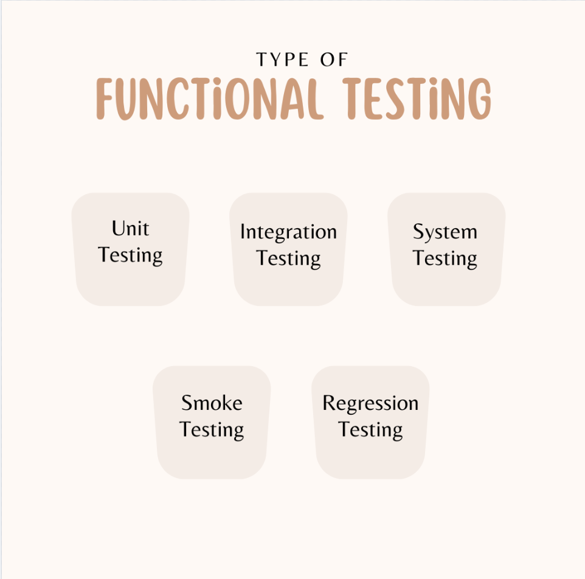

## What is functional Testing?

Functional testing is a type of software testing that verifies that the software system or application behaves according to the specified functional requirements and meets the intended business needs. It focuses on ensuring that the system's features, capabilities, and interactions with different components work as expected.

Functional testing is typically performed by providing the software with input data and then checking the output data to see if it matches the expected results. This can be done manually or using automated testing tools.

## Types of Functional Testing

  

[Functional Testing](https://keploy.io/blog/community/functional-testing-unveiling-types-and-real-world-applications)

There are many different types of functional testing, including:

### 1. Unit Testing

Unit testing is the most granular form of functional testing, focusing on individual components or modules of the software. Developers typically write unit tests to ensure that each function or method performs as expected. The goal is to verify that a single unit of the software works independently before integrating it with other units.

**Example:** Consider a function that calculates the sum of two numbers. Unit testing would involve writing test cases to check if the function:

- Returns the correct sum for positive integers.
- Handles negative numbers correctly.
- Deals with edge cases, such as zero or extremely large values.

Each of these scenarios would be tested in isolation to confirm that the function behaves as expected.

### 2. Integration Testing

Integration testing ensures that different modules or components of the software work together correctly. While unit tests verify individual parts, integration testing focuses on how they interact when combined. This technique is essential for uncovering issues that arise due to the interaction between modules.

**Example:** In an e-commerce platform, individual modules like the product catalog, shopping cart, and payment system may pass their respective unit tests. However, integration testing ensures that:

- The shopping cart properly calculates the total price based on items from the catalog.
- The payment system successfully processes transactions using the data passed from the cart.

By simulating real-world interactions between modules, integration testing ensures smooth communication across components.

### 3. System Testing

System testing is a comprehensive technique that evaluates the complete and integrated system. It tests the software as a whole to ensure it meets the functional requirements. The goal is to validate that all features work together as expected in the final product.

**Example:** For a social media application, system testing might include scenarios like:

- Creating, editing, and deleting a post.
- Liking and sharing posts.
- Sending friend requests and messages.

System testing covers the entire workflow to ensure that the software behaves as a fully functional system.

### 4. Smoke Testing

Smoke testing, also known as "sanity testing," is a quick and basic check to determine if the core functionalities of the software are working. It’s typically performed after a new build to ensure that no critical issues exist before proceeding to more in-depth testing. If the smoke test passes, the software is considered stable enough for further testing.

**Example:** For a mobile app, a smoke test might include:

- Launching the app and verifying that it loads properly.
- Logging into the app with valid credentials.
- Navigating to a few critical screens to ensure no crashes occur.

By quickly validating key functions, smoke testing saves time by catching major issues early.

### 5. Regression Testing

Regression testing involves re-testing the entire software or selected parts to ensure that recent code changes haven't broken any existing functionality. It is crucial after bug fixes, enhancements, or updates to make sure that previously working features still perform correctly.

**Example:** After fixing a bug in the user registration process, regression testing would re-test not only the registration feature but also other related features like login, profile updates, and password recovery, ensuring that nothing else was impacted by the change.

By maintaining stable software over time, regression testing prevents unwanted side effects from updates.

## What do we test in functional Testing?

### 1. User Interface (UI)

The user interface is often the first point of interaction for users, making it essential for functional testing. Here, we check if:

- All buttons, forms, and elements are present and functional.
- The interface behaves as expected across different devices and browsers.
- User inputs (like text fields, drop-down menus, etc.) are validated and handled correctly.

### 2. APIs

APIs serve as the backbone of communication between different services in a system. During functional testing, API tests focus on:

- Validating API responses for different requests.
- Ensuring API endpoints perform the expected operations (GET, POST, PUT, DELETE).
- Handling errors and edge cases effectively.

### 3. Forms and Data Entry

Forms are common in web and mobile applications, and testing them involves:

- Verifying input field behaviors for different data types (e.g., text, numbers, special characters).
- Ensuring proper data validation, error messages, and form submission processes.
- Testing field limits and edge cases, like empty fields or invalid inputs.

### 4. Business Logic

This is where the core functionality of the application is tested. We ensure that:

- The software performs the tasks it’s supposed to, based on business requirements.
- Calculations, workflows, and rule engines execute properly.
- Conditions, loops, and processes operate as intended, without deviation from the expected results.

### 5. Database Operations

Functional testing extends to database verification to confirm:

- Correct data is stored, retrieved, updated, and deleted.
- The integrity and consistency of data is maintained across different functions.
- Transactions and error handling work as expected.

## What are the steps to perform Functional Testing?

### 1. Understand the Requirements

Before jumping into testing, you need a clear understanding of the functional requirements. These requirements serve as the benchmark for what the software is supposed to do. Review user stories, use cases, and requirement documents thoroughly. If you’re using a tool like JIRA or Asana, extract the requirements for each feature you're going to test.

### 2. Identify Test Scenarios

Once you know the requirements, start creating test scenarios. These are high-level concepts of what to test, usually expressed as the interactions between the user and the system.

For example, if you are testing a login feature, your test scenarios could include:

- Valid login credentials
- Invalid password
- Empty input fields
- Forgotten password flow

### 3. Write Test Cases

A test case is a more detailed, step-by-step outline of what needs to be tested. Every test case should include:

- **Test case ID**: A unique identifier for the test case.
- **Test description**: What is being tested.
- **Preconditions**: Any setup needed before the test begins.
- **Test steps**: Detailed instructions on how to execute the test.
- **Expected results**: The outcome that should happen if the feature works as intended.

### 4. Set Up the Test Environment

Make sure your test environment mimics production as closely as possible. This includes using the same version of databases, servers, and operating systems. Setting up a stable and consistent test environment ensures that any defects you find are real and not caused by environmental differences.

If you're using automation tools like **Selenium** or **Cypress**, ensure they are properly integrated with your test environment. For manual testing, keep your browsers, devices, or virtual machines ready.

### 5. Execute the Tests

Now it’s time to execute the test cases. Depending on your approach, this can either be manual or automated:

- **Manual Testing**: Follow the steps in your test cases one by one and check the actual results against the expected outcomes. If any test fails, document the issue, and move on to the next test case.
- **Automated Testing**: If you have automated the functional tests, run your scripts to validate the functionality of the application. Automated tools like **Cypress**, **Selenium**, or **JUnit** can help streamline this process.

## Benefits of functional testing:

- It helps to ensure that the software system meets the specified requirements.
- It helps to identify defects in the software system early in the development process.
- It helps to improve the quality of the software system.
- It helps to reduce the risk of system failure.

## Challenges of functional testing:

- It can be time-consuming and expensive.
- It can be difficult to test all of the possible scenarios.
- It can be difficult to test the software system in its real-world environment.

## Best Practices for functional testing:

### 1. Use Version Control for Test Scripts

If you're automating tests, store your test scripts in version control systems (e.g., Git). This helps:

- **Track changes**: Easily review and manage updates to test scripts.
- **Collaborate**: Multiple team members can work on the same test suite without overwriting each other's work.

### 2. Optimize Test Data Management

Test data should be handled with care. Use the following strategies to manage test data:

- **Use test data generators**: Tools like Faker or Mockaroo can generate dynamic test data.
- **Database rollbacks**: Ensure that test data is rolled back or cleaned up after test execution to maintain consistency.
- **Data isolation**: Avoid using production data unless necessary, and ensure sensitive data is anonymized.

### 3. Leverage Continuous Integration (CI) Pipelines

Integrate functional tests into your Continuous Integration (CI) pipelines. This ensures:

- **Frequent validation**: Tests run automatically with every code commit or pull request.
- **Early detection**: Bugs can be caught early before they make it to production.

## Conclusion

Despite the challenges, functional testing is an important part of the software testing process. By following good functional testing practices, you can help to ensure that the software system meets the specified requirements and meets the intended business needs.

## Frequently Asked Questions

### 1. What is Functional Testing?

**Functional testing** is a type of testing that ensures software behaves according to its specified requirements. It focuses on verifying that the features and functionalities of the application work as expected.

### 2. What are the different types of Functional Testing?

Some common types of functional testing include:

- **Smoke Testing**: Ensures that the most critical functions work.
- **Sanity Testing**: Verifies the functionality after minor changes.
- **Regression Testing**: Ensures that new code changes haven’t broken existing functionality.
- **Integration Testing**: Ensures that different modules of the application work together.

### 3. What tools are used for Functional Testing?

Popular tools for functional testing include:

- **Selenium**: An open-source tool for automating web applications.
- **JUnit**: A unit testing framework commonly used in Java projects.
- **Cypress**: A front-end testing tool built for modern web applications.
- **TestComplete**: A functional UI testing tool that supports desktop, mobile, and web apps.

### 4. How do you prioritize test cases for functional testing?

Test cases should be prioritized based on:

- **Business impact**: Features critical to the business should be tested first.
- **User frequency**: Features used most often by end-users should take priority.
- **Complexity**: More complex features often require more in-depth testing.

### 5. What is the difference between Functional Testing and Non-Functional Testing?

- **Functional Testing** focuses on verifying that the application works according to the specified functional requirements.
- **Non-Functional Testing** focuses on performance, usability, reliability, and other non-functional aspects of the software.
