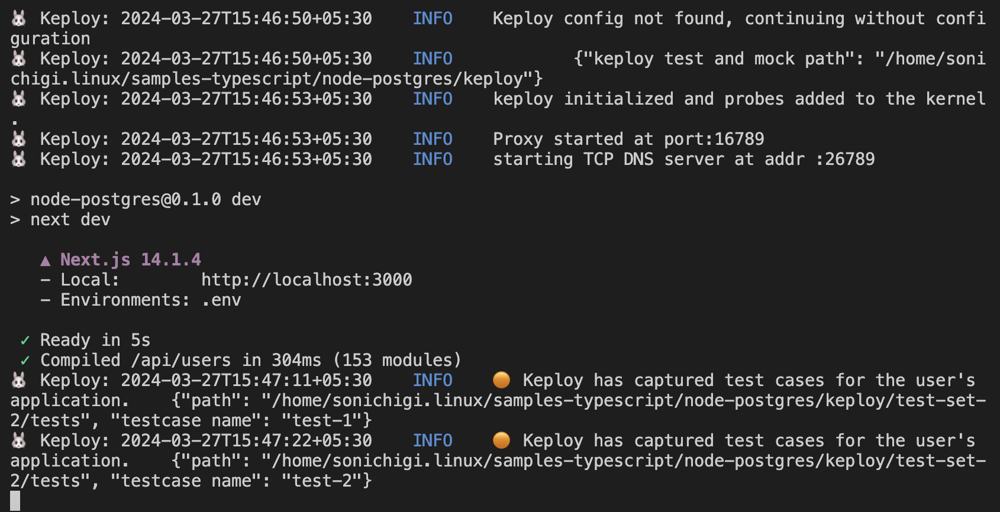
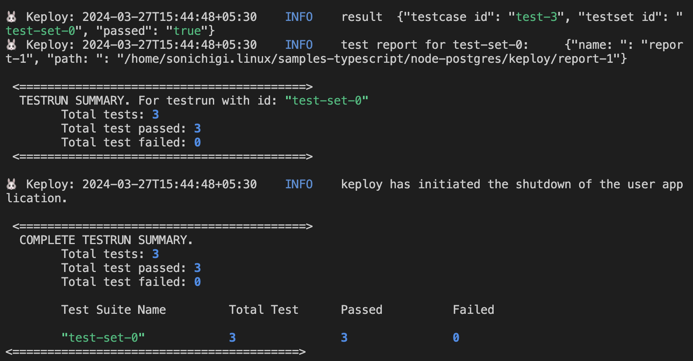

## Introduction

This is a sample app to test Keploy integration capabilities using NextJS and Postgres with Drizzle ORM. Buckle up, it's gonna be a fun ride! 🎢

import InstallationGuide from '../concepts/installation.md'

<InstallationGuide/>

## Get Started! 🎬

Now that we have bun installed, we will setup our application.

```bash
git clone https://github.com/keploy/samples-typescript && cd samples-typscript/nextjs-postgres

## Download node modules
npm install

# start the database instance
docker-compose up
```

## Installation 📥

- [Using Docker container for Postgres and running application locally](#running-app-locally-on-linuxwsl-)

## Running App Locally on Linux/WSL 🐧

We'll be running our sample application right on Linux, but just to make things a tad more thrilling, we'll have the database (Redis) chill on Docker. Ready? Let's get the party started!🎉

### Capture testcase

Ready, set, record! Here's how:

```bash
sudo -E env PATH=$PATH keploy record -c 'npm run dev'
```

Alright, magician! With the app alive and kicking, let's weave some test cases. The spell? Making some API calls!

#### Generate testcases

**1. Create Post request**

```sh
curl -X POST -H "Content-Type: application/json" -d '{"name":"John","email":"doe@example.com"}' http://localhost:3000/api/users
```

This will return the response:

```json
{
  "users": [
    {
      "id": 3,
      "name": "John",
      "email": "doe@example.com",
      "createdAt": "2024-03-27T10:07:30.172Z"
    }
  ]
}
```

**2. Make Get Request**

```sh
curl -X GET http://localhost:3000/api/users
```



Give yourself a pat on the back! With that simple spell, you've conjured up test cases with a mock! Explore the **Keploy directory** and you'll discover your handiwork in `test-1.yml` and `mocks.yml`.

Want to see if everything works as expected?

### Run Tests

Time to put things to the test 🧪

```shell
sudo -E env PATH=$PATH keploy test -c "npm run dev" --delay 10
```



> The `--delay` flag? Oh, that's just giving your app a little breather (in seconds) before the test cases come knocking.

Final thoughts? Dive deeper! Try different API calls, tweak the DB response in the `mocks.yml`, or fiddle with the request or response in `test-x.yml`. Run the tests again and see the magic unfold!✨👩‍💻👨‍💻✨

### Wrapping it up 🎉

Congrats on the journey so far! You've seen Keploy's power, flexed your coding muscles, and had a bit of fun too! Now, go out there and keep exploring, innovating, and creating! Remember, with the right tools and a sprinkle of fun, anything's possible. 😊🚀

Hope this helps you out, if you still have any questions, reach out to us .

import GetSupport from '../concepts/support.md'

<GetSupport/>
