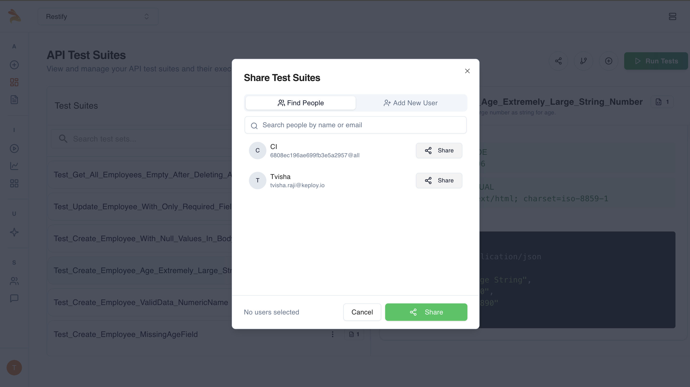

Keploy makes it easy to share any test suite so others can review results or run the tests in their own environments—without copying JSON or clunky exports.

## Open the Share Dialog

In the **Test Suites** list, hover over a suite row and click the **Share** icon (🔗).

The **Share Test Suites** modal appears with two tabs:

- **Find People** – Search existing workspace members.
- **Add New User** – Invite someone via email.

## Confirm & Notify

Click **Share**. Keploy sends:

- An email
  with a direct link to the suite.

New users must **accept the invite** to gain access.
