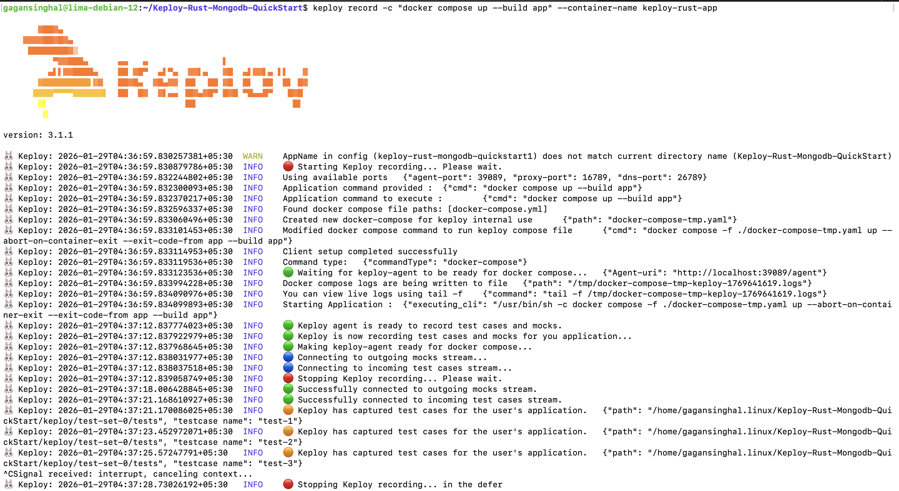
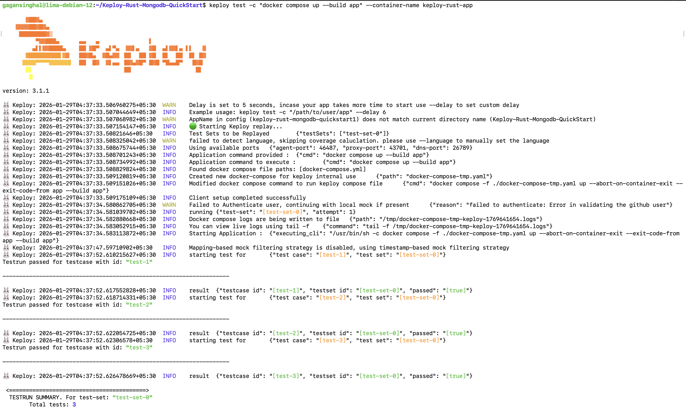
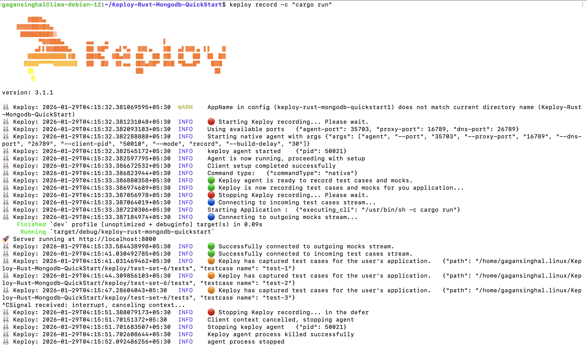
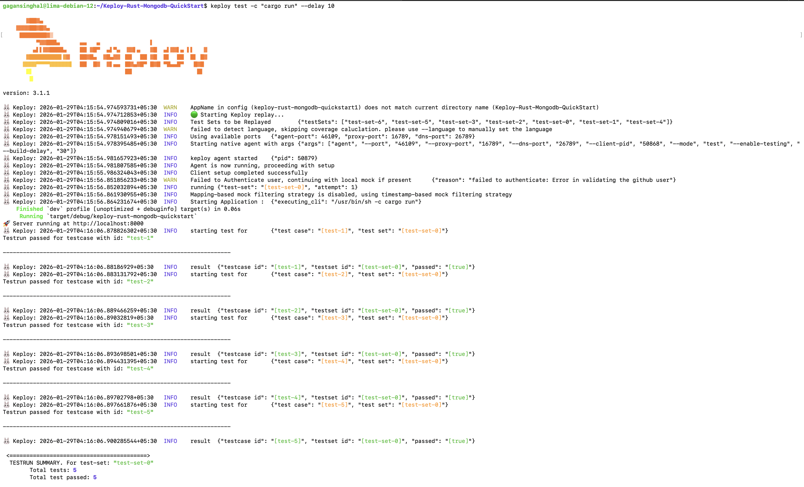

import EnterpriseInstallReminder from '@site/src/components/EnterpriseInstallReminder';
import SectionDivider from '@site/src/components/SectionDivider';
import ProductTier from '@site/src/components/ProductTier';

# Using Docker Compose 🐳 {#using-docker-compose}

<ProductTier tiers="Enterprise" offerings="Self-Hosted, Dedicated" />

A simple **Notes REST API** built with **Rust** and **MongoDB**, showcasing **Keploy’s record & replay** capabilities without writing manual test cases.

<EnterpriseInstallReminder />

---

### Clone the Sample Application

```bash
git clone https://github.com/Gagan202005/Keploy-Rust-Mongodb-QuickStart.git
cd Keploy-Rust-Mongodb-QuickStart
```
### Rust (Cargo)

Rust is required to build and run the application.

Install Rust using **rustup**:
```bash
curl --proto '=https' --tlsv1.2 -sSf https://sh.rustup.rs | sh
source "$HOME/.cargo/env"
```
**Verify installation**:
```bash
rustc --version
cargo --version
```

### Lights, Camera, Record!


Start MongoDB and Mongo Express using Docker Compose:

```bash
docker compose up -d mongo mongo-express
```

Build & Run the Application 🛠️

```bash
docker compose up -d --build app
```

Verify the application:

```bash
curl http://localhost:8000/
```

Expected response:
```bash
Rust + MongoDB + Keploy Quickstart is running!
```
### Capture Test Cases

Start recording with Keploy:

```bash
keploy record -c "docker compose up --build app" --container-name keploy-rust-app
```

Now make some API calls (via curl, Postman, or Hoppscotch).

1️⃣ Create a Note

```bash
curl -X POST http://localhost:8000/notes \
  -H "Content-Type: application/json" \
  -d '{"text":"hello keploy"}'
  ```

Response:

```bash
{
  "text": "hello keploy"
}
```

2️⃣ Fetch All Notes

```bash
curl http://localhost:8000/notes
```

Response:

```bash
{
  "text": "hello keploy"
}
```
We will get output something like this:



Keploy automatically records:

- HTTP test cases

- MongoDB mocks

Recorded data is stored at:

```bash
keploy/test-set-0/tests
keploy/test-set-0/mocks
```

### Run Tests ▶️

Replay the recorded test cases:

```bash
keploy test -c "docker compose up --build app" --delay 10 --container-name keploy-rust-app
```
We will get output something like this:



The --delay flag allows the application time to start before replay begins.

<SectionDivider />
# Running Locally on Linux / WSL 🐧 {#running-app-locally}

<ProductTier tiers="Enterprise" offerings="Self-Hosted, Dedicated" />
A simple Notes REST API built with Rust and MongoDB, showcasing Keploy’s record & replay capabilities without writing manual test cases.


In local mode:


- MongoDB runs in Docker

- Rust application runs using cargo run

### Clone the Sample Application

```bash
git clone https://github.com/Gagan202005/Keploy-Rust-Mongodb-QuickStart.git
cd Keploy-Rust-Mongodb-QuickStart
```
### Rust (Cargo)

Rust is required to build and run the application locally.

Install Rust using **rustup**:
```bash
curl --proto '=https' --tlsv1.2 -sSf https://sh.rustup.rs | sh
source "$HOME/.cargo/env"
```

**Verify installation**:
```bash
rustc --version
cargo --version
```
### Lights, Camera, Record!

**Start MongoDB**

```bash
docker compose up -d mongo mongo-express
```

**Run the Application**

```bash
cargo run
```

You should see:
```bash
Server running at http://localhost:8000
```
### Record Tests (Local)

Start recording:

```bash
keploy record -c "cargo run"
```

Now make some API calls (via curl, Postman, or Hoppscotch).

1️⃣ Create a Note

```bash
curl -X POST http://localhost:8000/notes \
  -H "Content-Type: application/json" \
  -d '{"text":"hello keploy"}'
  ```

Response:

```bash
{
  "text": "hello keploy"
}
```

2️⃣ Fetch All Notes

```bash
curl http://localhost:8000/notes
```

Response:

```bash
{
  "text": "hello keploy"
}
```
We will get output something like this:




Stop recording:

- `Ctrl + C`

### Replay Tests (Local)

```bash
keploy test -c "cargo run" --delay 10
```
We will get output something like this:



<SectionDivider />

# Wrapping It Up

You’ve successfully:

- Built a Rust + MongoDB REST API

- Recorded real API traffic using Keploy

- Replayed deterministic tests without hitting the database

Feel free to explore further by modifying:

- `test-x.yml`

- `mocks.yml`

Happy Testing with Keploy 🐰✨

<SectionDivider />