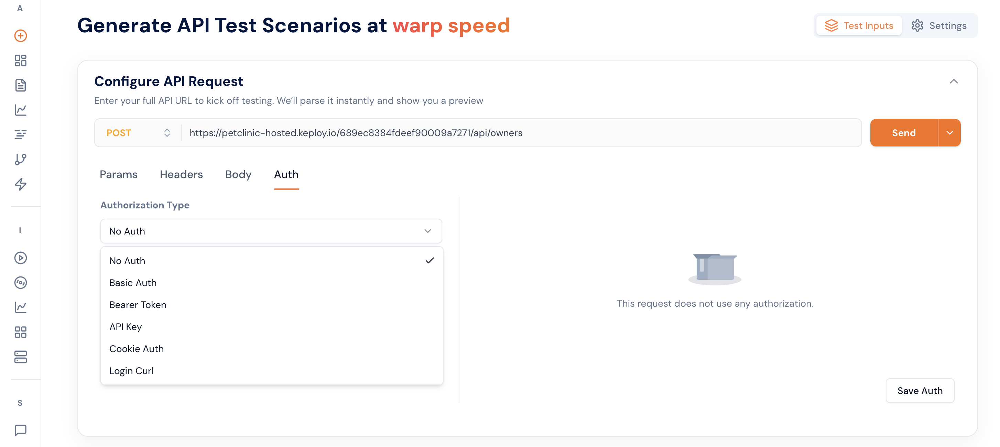
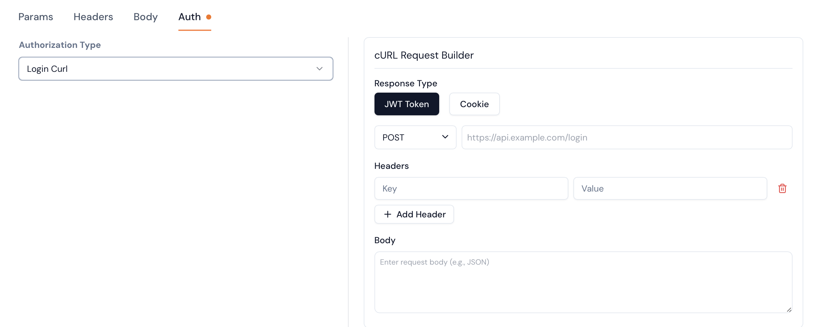
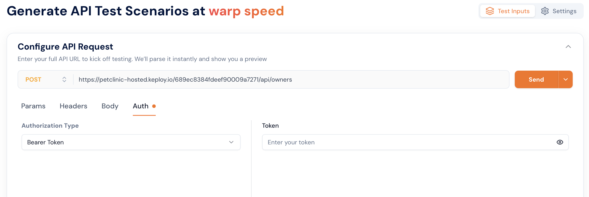

import ProductTier from '@site/src/components/ProductTier';

<ProductTier tiers="Free, Teams, Scale, Enterprise" offerings="Self-Hosted, Dedicated" />

This guide will help you setup your application Auth in API Test Generation and Run

### 1. Login API

This Auth option is for the application which provides a login API. Keploy will execute this login API when ever the auth token is required and use it in the API calls either in generation or run.

JWT Token - Keploy will execute this API and take the token from the json response value with the key "token" or "access_token" or "jwt"

Cookie - Keploy will execute this API and take the cookie from response headers with key value "Set-Cookie"

### 2. Bearer Token

This Auth option is for the application which can be authenticated using jwt token. This token is used in all the API calls that are done by Keploy to the application.
